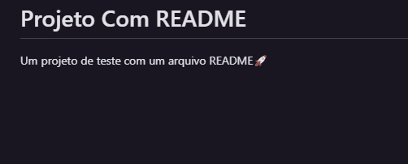

#  Projeto Com README
Um projeto de teste com um arquivo README🚀
[]

## Tecnologias Utilizada
- HTML
- CSS
- JS

## Como utilizar
```
git clone <url>
```

Acesse a Pasta do Projeto
```
cd repositorio-com-readme
```